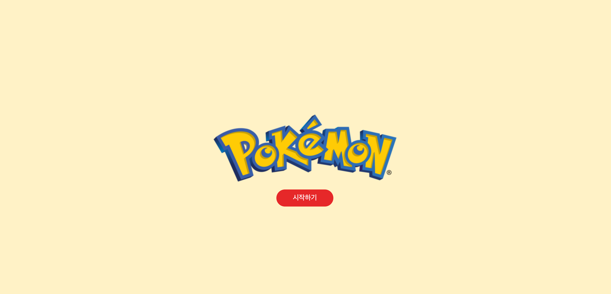
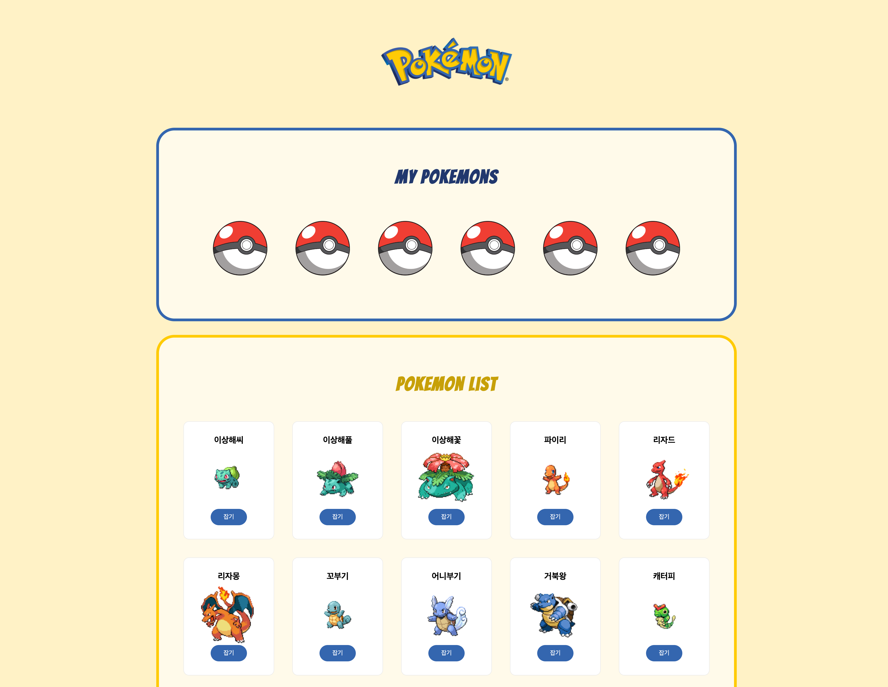
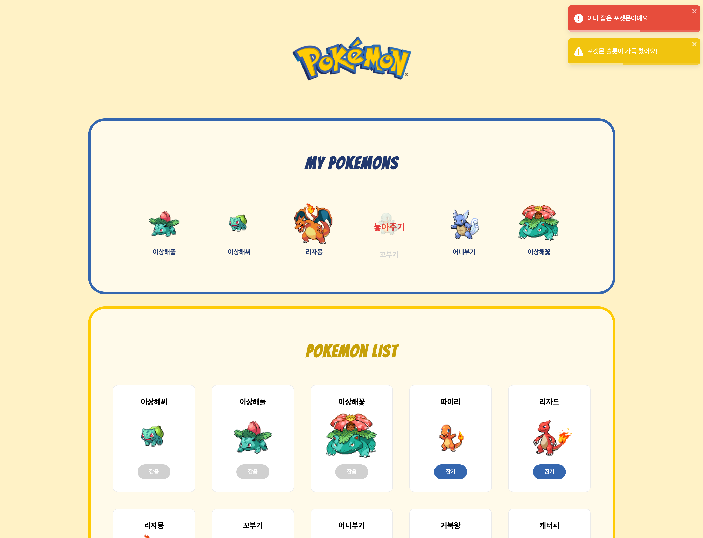

<!-- ####### 헤더 -->

# ⚡️ Pokemon : Pokemon Dex
https://pokemon-dex-three.vercel.app/

 

세가지 방식(props-drilling, contextAPI, RTK)으로 만든, 다양한 포켓몬을 확인할 수 있는 포켓몬 도감 사이트입니다.

모달을 통해 포켓몬의 자세한 정보를 확인할 수 있고,
원하는 포켓몬을 잡거나 놓아줄 수 있습니다.

 

 
 
 
 
 

<!-- ####### 프로젝트 소개 -->

<!-- 제목 -->

## 🎤 Project Introduction
 

<!-- 기간 -->

### ✔️ **Development Period**
2025/02/04 ~ 2025/02/06

 
<!-- 테크 스택 -->

### ✔️ **Tech Stack**

react, redux, react-toastify(UI library) 등을 사용해 만든 프로젝트입니다.

 
 
 
 
 

<!-- ####### 프로젝트 특징 -->

<!-- 제목 -->

## ✨ Project Features
 

<!-- 특징 하나 -->

### ✔️ **UXUI**

사용성을 고려한 사용자 위주의 페이지를 구현하고자 했습니다.

>- **직관적인 사용성**을 고려하여 포켓몬 슬롯이 가득 찼거나, 이미 잡은 포켓몬일 경우 알림창을 사용하거나 버튼 ui에 변화를 주었습니다.
>
>- **UI 라이브러리**를 활용하여 페이지의 디자인 무드를 통일시켰습니다.
>
>- **다양한 transition**을 적용하여 재미를 더했습니다.

 

<!-- 특징 둘 -->

### ✔️ **Local Storage**

local storage를 활용하여 새로고침 해도 잡은 포켓몬이 유지되도록 했습니다.

>- 브라우저 종료 후 다시 접속해도 여전히 잡은 포켓몬을 확인할 수 있습니다.

 
 
 
 
 

## :paperclip: Tech Blog Address

 

https://ijooha.tistory.com/

 
 
 
 
 

---
### 🌟 Thanks for visiting **Juha's github** ! 🌟

 
 
 
 
 
